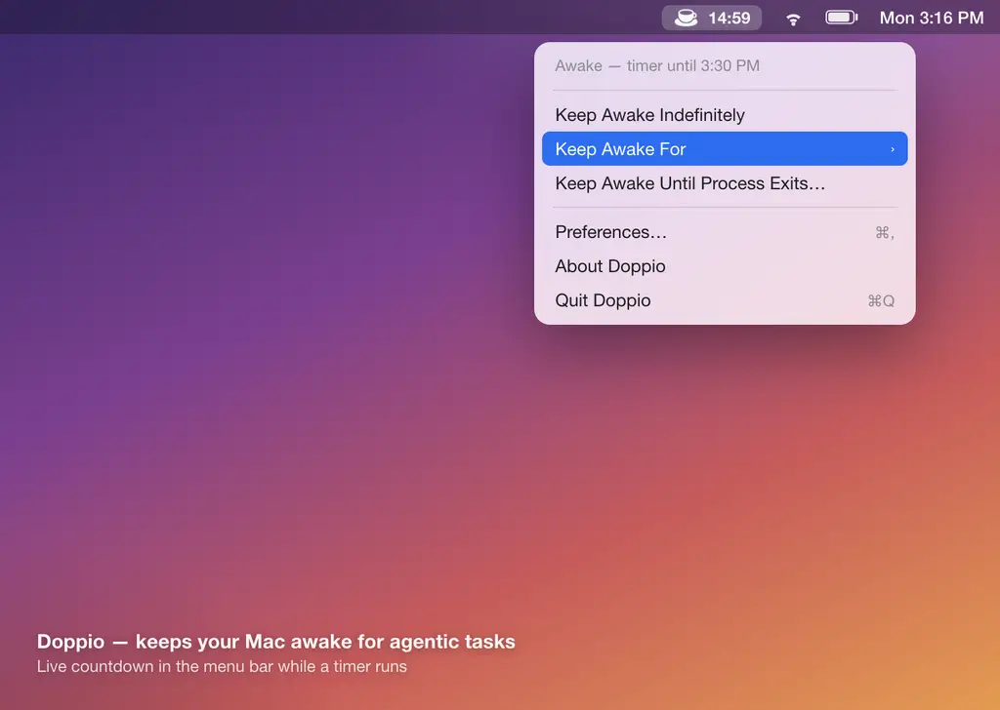
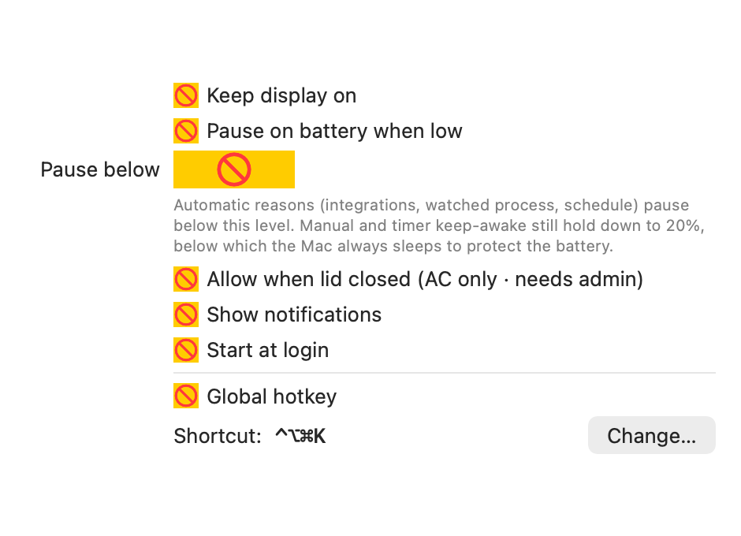

# Doppio

A tiny macOS menu-bar app that keeps your Mac awake for long-running **agentic
tasks** — Claude Code, omp, opencode, Codex, Gemini, or anything else —
including **while the screen is locked** and **with the lid closed**.

It is a more reliable, task-aware replacement for `caffeinate`.



## Why not just `caffeinate`?

`caffeinate` has two gaps that break agent workflows:

1. **Lock the screen and the task often stops / the Mac still sleeps.** A basic
   idle assertion isn't always enough.
2. **Closing the lid always sleeps the Mac.** Power assertions *cannot* prevent
   clamshell (lid-closed) sleep — only disabling sleep at the `pmset` level can,
   and that needs root.

Doppio handles both, and it can decide *on its own* when to stay awake by
watching for your agent processes.

## What it does

- **Task-aware.** While Claude Code, omp, opencode, Codex, or Gemini is running an
  interactive session, the Mac stays awake — then it's allowed to sleep again
  (after a short grace period). Detection is **presence-based, not CPU-based**,
  so a long model call that uses ~0% CPU never lets the Mac doze off mid-task.
  Persistent Claude Code background daemons (`claude daemon`, `bg-pty-host`,
  `bg-spare`) are ignored so an idle machine isn't pinned awake forever.
- **Timer mode (no integration needed).** Keep awake for 15 min … 8 hours, or
  **until a specific wall-clock time** — works even when locked.
- **Manual mode.** "Keep Awake Indefinitely" toggle.
- **Global hotkey.** Toggle keep-awake from anywhere — default **⌃⌥⌘K**, or set
  your own in Preferences (Carbon hotkey, no Accessibility permission). A brief
  on-screen HUD ("Keep Awake On/Off") confirms each press.
- **Keep awake until a process exits.** Pick any running process from the menu;
  Doppio holds until it quits, then releases automatically.
- **Schedule.** Keep awake during a recurring weekly window (e.g. Mon–Fri
  09:00–18:00, overnight windows supported). Configure it from the menu.
- **Notifications.** Optional toast when a timer or scheduled window ends.
- **Stays awake when locked.** Uses an IOKit `PreventUserIdleSystemSleep`
  assertion (the reliable primitive `caffeinate` wraps).
- **Works with the lid closed.** Optional "Allow When Lid Closed" flips
  `pmset disablesleep` (one admin prompt) and reverts it the moment the Mac is
  allowed to sleep again or the app quits.
- **Keep Display On** (optional) — otherwise only the system stays awake and the
  screen may turn off, which is usually what you want for a locked machine.
- **Runs in the background** as a menu-bar agent (no Dock icon), with optional
  **Start at Login**. The menu shows status + quick actions; all configuration
  lives in a **Preferences window** (⌘,).
- **Custom processes** — add any other process name (e.g. `aider`,
  `cursor-agent`) to the watch list.

All configuration lives in a native Preferences window:



## Install via Homebrew

Doppio is distributed as a Homebrew **cask** via the `relyweb/doppio` tap:

```bash
brew tap relyweb/doppio
brew trust relyweb/doppio        # third-party taps must be trusted once
brew install --cask doppio
open -a Doppio                    # launches the menu-bar app
```

Upgrade / remove:

```bash
brew upgrade --cask doppio
brew uninstall --cask doppio     # add --zap to also delete preferences
```

> The app is ad-hoc signed, not notarized (no Apple Developer ID). The cask's
> `postflight` strips the Gatekeeper quarantine flag on install, so it launches
> without the "unidentified developer" prompt. If macOS still blocks it, run
> `xattr -dr com.apple.quarantine /Applications/Doppio.app` or approve it under
> System Settings > Privacy & Security.

## Requirements

- macOS 13 or later (built and tested on macOS 26 / Apple Silicon).
- Swift toolchain (Xcode or Command Line Tools).

## Build

```bash
./build.sh
```

This compiles a release binary and assembles `Doppio.app` (ad-hoc signed).

```bash
open ./Doppio.app                      # run it
cp -R ./Doppio.app /Applications/       # install it
```

The espresso-cup icon appears in the menu bar. Filled = awake, outline = sleep
allowed.

## How it decides to stay awake

The Mac is kept awake if **any** of these is true:

```
manual toggle ON
  OR  timer active (not yet expired)
  OR  an enabled integration/custom process is running (+ grace period)
  OR  a live task token exists in ~/.doppio/active
```

When none hold, the assertion is released and (if it was set) `disablesleep` is
restored to 0, so normal sleep resumes. With **Pause on battery when low** on and
running on battery, automatic reasons yield below the soft floor while explicit
intent (manual/timer) holds until a hard 15% floor (see Battery & thermal safety).

## Signal an active task (precise integration)

Process-name detection is a heuristic. For exact control, any tool can tell
Doppio it is busy by dropping a token in `~/.doppio/active/`:

```bash
mkdir -p ~/.doppio/active
# Tie keep-awake to a command's lifetime (auto-clears on exit or crash):
tok=~/.doppio/active/$$; echo $$ > "$tok"; trap 'rm -f "$tok"' EXIT
your-long-running-agentic-task
```

A token counts as **live** if its contents are a running PID, or if it was
modified within the last 2 minutes (heartbeat). Dead/stale tokens are removed
automatically, so a crashed tool can never pin the Mac awake forever. Wire this
into Claude Code / omp / opencode / Codex / Gemini hooks for rock-solid keep-awake.

## Battery & thermal safety

- **Pause on battery when low** (Preferences → General): while on battery, once
  the charge drops below the chosen floor (20–90%, default 30%) the **automatic**
  reasons (integrations, watched process, schedule) stop keeping the Mac awake.
  **Explicit** intent (Keep Awake Indefinitely / a timer) is still honored down
  to a hard 15% safety floor, below which the Mac is always allowed to sleep so
  a task can't drain the battery to death. On AC, none of this applies.
- **Lid-closed is AC-only.** "Allow When Lid Closed" disables sleep only while
  on AC power; on battery the lid still sleeps the Mac. Keeping a machine awake
  under load with the lid shut on battery can overheat it in a bag.

## The lid-closed prompt

Enabling **Allow When Lid Closed** runs, via a macOS admin dialog (no password
stored):

```
sudo pmset -a disablesleep 1
```

It is reverted to `0` when Doppio goes idle, switches to battery, or quits. As a
safety net Doppio writes a sentinel (`~/.doppio/lid-sleep-disabled`) while this
is active and, on the next launch after a crash, restores `disablesleep 0`
automatically — prompting only if sleep is in fact still disabled.

## Verify it works

Headless checks (build first, or run the binary inside the bundle):

```bash
Doppio.app/Contents/MacOS/Doppio --selftest        # assertion registers + releases
Doppio.app/Contents/MacOS/Doppio --selftest-modes  # exclusivity, battery policy, signals, schedule
Doppio.app/Contents/MacOS/Doppio --selftest-power  # battery % fetch, cross-checked with pmset
Doppio.app/Contents/MacOS/Doppio --diag            # power source, live signals, current policy
```

While the app runs you can watch its assertion live:

```bash
pmset -g assertions | grep Doppio
# pid NNNN(Doppio): ... PreventUserIdleSystemSleep named: "Doppio: running: ..."
```

## Project layout

```
Sources/Doppio/
  main.swift             App bootstrap (accessory app) + --selftest/--diag
  AwakeCoordinator.swift State machine: manual | timer | activity + battery policy
  PowerManager.swift     IOKit assertions + pmset disablesleep + crash recovery
  PowerSource.swift      AC/battery reader (IOKit power sources)
  ActivityMonitor.swift  Process detection + ~/.doppio/active signal tokens
  MenuController.swift    Menu-bar UI: status, countdown, quick actions
  PreferencesView.swift   SwiftUI Preferences window (General/Integrations/Schedule/Advanced)
  PreferencesWindow.swift Hosts the Preferences window (NSWindow + NSHostingController)
  SettingsModel.swift     Bridges the window to Preferences + live coordinator
  Preferences.swift       UserDefaults-backed settings
  Runtime.swift           Well-known ~/.doppio paths
  Notifier.swift          Timer/schedule notifications (UserNotifications)
  HotKey.swift            Configurable global toggle hotkey (Carbon)
  HotKeyRecorder.swift    Modal capture of a new shortcut
  Schedule.swift          Pure weekly-window logic
  SelfTest.swift          Headless self-tests (--selftest, --selftest-modes, --diag)
build.sh                 Compile + assemble Doppio.app
Info.plist               Bundle metadata (LSUIElement = menu-bar agent)
Resources/AppIcon.svg    Coffee-cup logo (design source)
Resources/AppIcon.icns   App icon compiled from the SVG (build.sh regenerates)
release.sh                Build, zip, publish the GitHub release, bump the tap cask
```

## Releasing a new version

The app source and release artifacts live here; the Homebrew **cask** lives in a
separate tap repo, [relyweb/homebrew-doppio](https://github.com/relyweb/homebrew-doppio),
so users can `brew tap relyweb/doppio` without a URL. To cut a release (requires
`gh` auth + push access to both repos):

```bash
./release.sh 0.2.1        # builds, zips, publishes v0.2.1, bumps the tap cask
git commit -am "doppio 0.2.1" && git push   # commit any source changes here
```

`release.sh` updates `Casks/doppio.rb` in the tap repo automatically. Users then
get it with `brew upgrade --cask doppio`.
